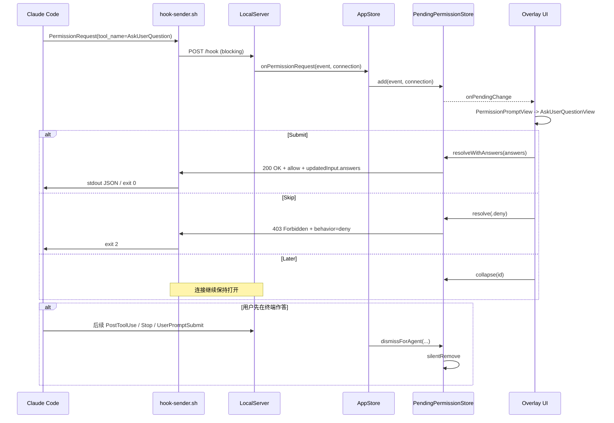

# Claude Hooks 问答弹窗逻辑梳理

## 文档目标

梳理这样一类场景的完整技术链路：

- Claude Code 在终端内运行时，遇到需要用户选择的问题
- Masko 通过 hooks 捕获该事件
- 桌面浮层弹出类似截图中的 `Question / Git Remote` 选择框
- 用户在浮层中作答后，结果再回传给 Claude Code

这份文档既说明当前实现，也给出可以直接落地的实施要点。

> [!summary]
> 结论先行：截图里的弹窗不是本地写死文案，也不是普通通知，而是 Claude Code 发出的 `PermissionRequest` 事件，其中 `tool_name == "AskUserQuestion"`。Masko 将它解析为结构化问题，再通过 `AskUserQuestionView` 渲染成你看到的单选弹窗。

## 场景结论

针对截图里的 `Git Remote` 场景，当前实现的真实逻辑是：

1. Claude Code 产生一个 `PermissionRequest` hook 事件。
2. 这个事件的 `tool_name` 是 `AskUserQuestion`。
3. 事件正文通过 `tool_input.questions` 携带标题、问题文案和选项。
4. Masko 本地 hook 脚本以阻塞方式把事件发给本地 HTTP 服务。
5. 本地服务保留连接，不立即返回，让桌面浮层等待用户决定。
6. 浮层根据问题结构渲染成单选卡片，并额外补出一个本地 `Other` 输入项。
7. 用户点击 `Submit` 后，Masko 构造 `updatedInput.answers` 回给 Claude。
8. 用户点击 `Skip` 后，Masko 返回 `deny`，Claude 侧将其视为拒绝。
9. 用户点击 `Later` 时，UI 只折叠卡片，不结束连接。

## 参与组件

| 组件 | 职责 | 关键文件 |
| --- | --- | --- |
| Claude Code | 产生 hook 事件，等待问题结果 | 外部系统 |
| HookInstaller | 把 hook 命令写入 `~/.claude/settings.json` | `Sources/Services/HookInstaller.swift` |
| hook-sender.sh | 从 hook stdin 读取 JSON，并转发到本地 HTTP 服务 | `Sources/Services/HookInstaller.swift` 内嵌脚本 |
| LocalServer | 接收 hook HTTP 请求，区分普通事件和 `PermissionRequest` | `Sources/Services/LocalServer.swift` |
| ClaudeEvent | 将 hook JSON 解码为本地模型 | `Sources/Models/ClaudeEvent.swift` |
| AppStore | 串接 server、store、overlay、快捷键 | `Sources/Stores/AppStore.swift` |
| PendingPermissionStore | 持有未决请求、保存连接、回传结果 | `Sources/Stores/PendingPermissionStore.swift` |
| PermissionPromptView | 根据数据类型选择具体 UI 分支 | `Sources/Views/Overlay/PermissionPromptView.swift` |
| AskUserQuestionView | 渲染结构化问题和选项 | `Sources/Views/Overlay/PermissionPromptView.swift` |
| OverlayManager | 控制浮层窗口创建、定位、聚焦、布局 | `Sources/Views/Overlay/OverlayManager.swift` |

## 端到端时序



## 第一层：Hook 注册与事件转发

### 1. Hook 注册

`HookInstaller` 会把多个 Claude Code hook 事件统一注册到 `~/.masko-desktop/hooks/hook-sender.sh`。

关注点：

- 订阅的事件包含 `PermissionRequest`
- 不是只监听工具执行，也监听会话、通知、任务等其他事件

关键代码：

- `Sources/Services/HookInstaller.swift:12-31`
- `Sources/Services/HookInstaller.swift:55-90`

### 2. hook-sender.sh 的关键行为

这个脚本有三个关键动作：

1. 检查本地服务是否存活，不存活就直接退出，避免终端卡住。
2. 从 hook stdin 读入原始 JSON。
3. 如果事件是 `PermissionRequest`，走阻塞式 `curl`；否则走 fire-and-forget。

关键代码：

- `Sources/Services/HookInstaller.swift:143-196`

这里最重要的一句注释是：

> Claude Code fires PermissionRequest for AskUserQuestion too (confirmed).

这说明：

- `AskUserQuestion` 在协议层并不是单独的 hook event
- 它被 Claude Code 包在 `PermissionRequest` 里
- 因此 Masko 必须在 `PermissionRequest` 分支内再根据 `tool_name` 做二次识别

### 3. 终端与 shell PID 注入

脚本还会沿进程树向上查找 terminal app PID 和 shell PID，并把它们注入到 JSON：

- `terminal_pid`
- `shell_pid`

这样浮层上的“回到终端”按钮才能精确聚焦到当前 Claude 所在终端。

关键代码：

- `Sources/Services/HookInstaller.swift:156-177`

## 第二层：本地服务如何接住这个请求

### 1. LocalServer 的 PermissionRequest 特殊处理

`LocalServer` 在收到 `POST /hook` 后先把 body 解码成 `ClaudeEvent`。

如果发现 `event.eventType == .permissionRequest`：

- 不会立刻 `200 OK`
- 会把 `event` 和 `NWConnection` 交给 `onPermissionRequest`
- 当前 HTTP 连接保持打开，直到用户决策

关键代码：

- `Sources/Services/LocalServer.swift:164-190`

这是整条链路最关键的机制。没有“保留连接”这一步，浮层就只能展示通知，无法真正把选择结果回传给 Claude。

### 2. 为什么服务端要先持有连接

因为上游 Claude Code 还在等待本次 `PermissionRequest` 的返回值。

当前实现不是：

- 先立即返回，再异步通知 Claude

而是：

- 直接持有原 TCP/HTTP 连接
- 等用户动作后，在同一连接上写回 HTTP 响应

这是一种同步问答模型。

## 第三层：事件如何变成结构化问题

### 1. ClaudeEvent 负责标准化解码

`ClaudeEvent` 把 hook JSON 解码为本地结构，和本场景直接相关的字段有：

- `hook_event_name`
- `session_id`
- `cwd`
- `tool_name`
- `tool_input`
- `permission_suggestions`
- `terminal_pid`
- `shell_pid`

关键代码：

- `Sources/Models/ClaudeEvent.swift:4-118`

### 2. AskUserQuestion 的识别条件

Masko 并不是看 `hook_event_name == AskUserQuestion`，而是看：

- `hook_event_name == PermissionRequest`
- `tool_name == AskUserQuestion`

真正的结构化解析逻辑位于 `PendingPermission.parsedQuestions`。

关键代码：

- `Sources/Stores/PendingPermissionStore.swift:105-162`

### 3. 当前实现实际消费的字段

从解析器看，当前 AskUserQuestion 分支只消费这些字段：

- `questions[].question`
- `questions[].header`
- `questions[].options[].label`
- `questions[].options[].description`
- `questions[].multiSelect`

也就是说，截图里的 UI 主要就是由这些字段驱动的：

- 顶部橙色标签 `Git Remote` -> `header`
- 主问题文案 -> `question`
- 每个选项标题 -> `options[].label`
- 灰色说明文案 -> `options[].description`

## 第四层：截图场景在协议层大致长什么样

> [!info]
> 下例中的字段名来自源码，字段值根据截图内容推导。也就是说，结构可靠，具体文案是本次 Git Remote 场景的示例值。

```json
{
  "hook_event_name": "PermissionRequest",
  "session_id": "session-xxx",
  "cwd": "/path/to/project",
  "tool_name": "AskUserQuestion",
  "tool_input": {
    "questions": [
      {
        "header": "Git Remote",
        "question": "Repository pekaboo/katana-obsidian doesn't exist. How would you like to proceed?",
        "options": [
          {
            "label": "Create under pekaboo org",
            "description": "Create pekaboo/katana-obsidian as a new repository"
          },
          {
            "label": "Create under wang-neo",
            "description": "Create wang-neo/katana-obsidian under your account"
          },
          {
            "label": "Skip for now",
            "description": "Keep commit local, don't push"
          }
        ]
      }
    ]
  }
}
```

这里要特别注意：

- `Other` 不是上游 payload 里的选项
- `Other` 是 Masko 在本地 UI 层补出来的附加输入能力

## 第五层：UI 是如何选中 AskUserQuestion 分支的

`PermissionPromptView` 有三条主要分支：

1. `toolName == "ExitPlanMode"` -> 走计划评审 UI
2. `parsedQuestions` 非空 -> 走 `AskUserQuestionView`
3. 其余 -> 走标准 Allow / Deny 权限卡片

关键代码：

- `Sources/Views/Overlay/PermissionPromptView.swift:807-852`

因此你截图里的界面不是一个额外模块，而是 `PermissionPromptView` 的第二条分支。

## 第六层：AskUserQuestionView 的渲染细节

### 1. 顶部区域

顶部会固定显示：

- `Question` 图标与标题
- 终端按钮
- `Later` 按钮

关键代码：

- `Sources/Views/Overlay/PermissionPromptView.swift:256-292`

### 2. 问题与选项渲染

每个问题会渲染：

- 可选 `header`
- `question` 文本
- 所有结构化选项
- 一个本地附加的 `Other`

关键代码：

- `Sources/Views/Overlay/PermissionPromptView.swift:398-556`

### 3. `Other` 的实现方式

`Other` 不是从 Claude payload 来的，而是本地 UI 逻辑：

- 点击 `Other` 后切换到文本输入模式
- 请求浮层成为 key window
- 激活 `TextField`

关键代码：

- `Sources/Views/Overlay/PermissionPromptView.swift:374-380`
- `Sources/Views/Overlay/PermissionPromptView.swift:500-556`
- `Sources/Views/Overlay/OverlayManager.swift:254-259`
- `Sources/Views/Overlay/OverlayPanel.swift:46-47`

### 4. 提交条件

只有所有问题都已有答案时，`Submit` 才可点击。

规则如下：

- 单选题：`selections[question] != nil`
- 多选题：集合不为空
- `Other`：文本不为空

关键代码：

- `Sources/Views/Overlay/PermissionPromptView.swift:244-254`
- `Sources/Views/Overlay/PermissionPromptView.swift:303-330`

## 第七层：用户动作如何回传给 Claude

### 1. Submit

点击 `Submit` 后：

1. UI 先把所有答案收集成 `[String: String]`
2. key 是问题原文 `question`
3. value 是用户最终选中的 label，或自定义文本
4. `PendingPermissionStore.resolveWithAnswers()` 将其拼到 `updatedInput.answers`
5. 返回 `200 OK`
6. 返回体包含 `behavior: allow`

关键代码：

- `Sources/Views/Overlay/PermissionPromptView.swift:305-317`
- `Sources/Stores/PendingPermissionStore.swift:487-527`

返回体形态如下：

```json
{
  "hookSpecificOutput": {
    "hookEventName": "PermissionRequest",
    "decision": {
      "behavior": "allow",
      "updatedInput": {
        "questions": [
          {
            "header": "Git Remote",
            "question": "Repository pekaboo/katana-obsidian doesn't exist. How would you like to proceed?",
            "options": [
              { "label": "Create under pekaboo org" },
              { "label": "Create under wang-neo" },
              { "label": "Skip for now" }
            ]
          }
        ],
        "answers": {
          "Repository pekaboo/katana-obsidian doesn't exist. How would you like to proceed?": "Create under wang-neo"
        }
      }
    }
  }
}
```

### 2. Skip

点击 `Skip` 会直接映射到 `deny`：

- HTTP 状态码：`403 Forbidden`
- 响应 JSON：`behavior = deny`
- 响应头：`X-Exit-Code: 2`

关键代码：

- `Sources/Views/Overlay/PermissionPromptView.swift:332-347`
- `Sources/Stores/PendingPermissionStore.swift:466-485`
- `Sources/Stores/PendingPermissionStore.swift:611-628`

返回体形态如下：

```json
{
  "hookSpecificOutput": {
    "hookEventName": "PermissionRequest",
    "decision": {
      "behavior": "deny"
    }
  }
}
```

### 3. Later

点击 `Later` 的行为不是允许，也不是拒绝，而是：

- 将当前 permission 卡片加入 `collapsed`
- 从主浮层折叠为简化 pill
- 不向 Claude 立刻回任何响应
- 原连接继续保持，等待后续处理

关键代码：

- `Sources/Stores/PendingPermissionStore.swift:364-370`
- `Sources/Views/Overlay/PermissionPromptView.swift:1157-1183`

这意味着 `Later` 本质上是“本地 defer”，不是“协议级 skip”。

## 第八层：通知、快捷键、终端联动

### 1. 通知标题为什么显示为 Question

`EventProcessor` 对 `PermissionRequest` 做了二次判断：

- 如果 `toolName == AskUserQuestion`
- 通知标题显示为 `Question`
- 通知正文显示第一个问题的文本

关键代码：

- `Sources/Services/EventProcessor.swift:66-85`

### 2. 快捷键行为

这个浮层可通过全局快捷键直接操作：

- `⌘1-9`：选择当前卡片中的第 N 个选项
- `⌘↩`：确认当前选择
- `⌘⎋`：拒绝当前顶部卡片
- `⌘L`：折叠为 Later
- `⌘M`：聚焦回终端

关键代码：

- `Sources/Stores/AppStore.swift:115-149`
- `Sources/Views/Overlay/PermissionPromptView.swift:355-395`
- `Sources/Views/Overlay/PermissionPromptView.swift:1154-1185`

### 3. 回到终端

终端按钮和 `⌘M` 依赖 hook 脚本注入的：

- `terminal_pid`
- `shell_pid`
- `cwd`

因此这个体验不是简单“激活终端应用”，而是尽量定位到正确的终端上下文。

## 第九层：窗口与布局逻辑

### 1. 浮层本质

这个问答框不是普通 app window，而是一个自定义 `NSPanel`：

- `.nonactivatingPanel`
- `level = .screenSaver`
- 跨 Spaces 显示
- 默认不抢主窗口
- 但 `canBecomeKey == true`，所以在需要文本输入时可以接收焦点

关键代码：

- `Sources/Views/Overlay/OverlayPanel.swift:8-20`
- `Sources/Views/Overlay/OverlayPanel.swift:28-47`

### 2. Permission 面板挂载方式

在 mascot 模式下，Masko 会创建三层窗口：

1. mascot panel
2. stats panel
3. permission panel

permission panel 会作为 child window 挂在 mascot / stats 上方。

关键代码：

- `Sources/Views/Overlay/OverlayManager.swift:222-270`

### 3. 智能定位

permission panel 会根据屏幕剩余空间优先级自动布局：

1. 上方
2. 右侧或左侧
3. 下方

同时计算 speech bubble tail 的方向和百分比位置。

关键代码：

- `Sources/Views/Overlay/OverlayManager.swift:902-1000`

这就是为什么同一个问答框在不同屏幕边缘会出现在不同方向，但仍保持“尾巴指向 mascot”的感觉。

## 第十层：状态清理与边界处理

### 1. 用户在终端先处理了问题

如果用户没有在浮层中答复，而是在终端里先完成了问题，Masko 会通过两条机制兜底：

- 连接监听：连接关闭后自动 `silentRemove`
- 事件监听：收到同一 session / agent 的后续事件后自动 dismiss

关键代码：

- `Sources/Stores/PendingPermissionStore.swift:372-463`
- `Sources/Stores/AppStore.swift:50-71`

### 2. 服务没启动时为什么不会卡终端

hook-sender.sh 在发请求前先访问 `/health`，服务不可用就直接退出，不进入长等待。

关键代码：

- `Sources/Services/HookInstaller.swift:150-152`

### 3. 多个待处理问题

`PendingPermissionStore` 支持多个 pending 项并排队展示。

当有多个请求时：

- UI 会出现 pending 数量
- 支持 `Allow All`
- 支持 `Deny All`

关键代码：

- `Sources/Views/Overlay/PermissionPromptView.swift:1115-1189`

## 第十一层：从实施角度看，当前方案最值得保留的设计

如果你想复用这套机制，下面四点必须保留：

### 1. AskUserQuestion 仍走 PermissionRequest 通道

不要把它拆成独立事件类型。当前上游协议就是走 `PermissionRequest`，客户端只需做 subtype 分流。

### 2. 连接必须阻塞持有

这类问答不是“展示通知”，而是“同步等待回答”。因此必须像现在这样保留原连接，等用户动作后再返回。

### 3. UI 只负责渲染与收集，不直接理解业务

像 `Git Remote`、`Repository ... doesn't exist` 这类文案都应来自上游 payload，而不是硬编码在客户端内。

### 4. 回传必须使用 updatedInput

当前实现通过：

- `decision.behavior = allow`
- `decision.updatedInput.answers = ...`

把答案塞回原始输入，这种方式与现有协议适配最好。

## 第十二层：当前实现的几个可优化点

这部分是“现状梳理后的实施建议”，适合后续演进。

### 1. `answers` 目前以问题全文作为 key

现状：

- `answers` 的 key 是 `question` 文本本身

风险：

- 多个问题文案相同会冲突
- 文案变化会影响回传稳定性
- 不利于国际化

建议：

- 如果上游协议能提供稳定 `id`，优先以 `id` 回传
- 如果暂时没有 `id`，至少使用 `questionIndex` 或 `header + index` 作为内部 key

### 2. 多选答案被压平成逗号字符串

现状：

- 多选题最终被拼接为 `a, b, c`

风险：

- 丢失原始数组结构
- label 本身若带逗号，语义会歧义

建议：

- 内部先保留 `[String]`
- 在最后一层协议适配时再决定是否转字符串

### 3. `Later` 没有过期控制

现状：

- 折叠后连接继续持有
- 没有单独 TTL

风险：

- 长时间悬挂连接
- 用户可能忘记还有未处理问题

建议：

- 为 collapsed 项增加超时策略
- 或在超时后自动改为 deny / 自动重新展开 / 再次通知

### 4. AskUserQuestion 解析逻辑仍混在 PendingPermissionStore 内

现状：

- 协议解析、pending 生命周期、回传拼装都集中在同一个 store

建议：

- 抽出 `AskUserQuestionAdapter`
- 将职责拆成：
  - payload 解析
  - UI view model
  - 回传协议编码

这样后续接入更多 elicitation 类型时更容易扩展。

## 第十三层：建议的最小实施清单

如果目标是在另一套客户端里复刻同类能力，最小可实施版本可以按下面步骤做：

1. 注册 `PermissionRequest` hook，并保证使用阻塞式回调。
2. 将 hook body 解码为统一事件模型，至少保留 `tool_name` 与 `tool_input`。
3. 识别 `tool_name == AskUserQuestion`。
4. 解析 `tool_input.questions[]` 为本地 view model。
5. 渲染单选、多选、补充输入框。
6. 提交时构造 `decision.behavior = allow` 与 `decision.updatedInput.answers`。
7. 拒绝时返回 `decision.behavior = deny` 与非 0 退出码。
8. 持有未决连接，并在用户处理后原路回写 HTTP 响应。
9. 建立 stale connection 清理机制。
10. 为“终端聚焦”和“Later”提供独立的本地交互能力。

## 源码定位清单

- `Sources/Services/HookInstaller.swift:12-31`
- `Sources/Services/HookInstaller.swift:143-196`
- `Sources/Services/LocalServer.swift:164-190`
- `Sources/Models/ClaudeEvent.swift:4-118`
- `Sources/Services/EventProcessor.swift:66-85`
- `Sources/Stores/AppStore.swift:50-149`
- `Sources/Stores/PendingPermissionStore.swift:105-162`
- `Sources/Stores/PendingPermissionStore.swift:346-527`
- `Sources/Stores/PendingPermissionStore.swift:611-628`
- `Sources/Views/Overlay/PermissionPromptView.swift:225-556`
- `Sources/Views/Overlay/PermissionPromptView.swift:807-852`
- `Sources/Views/Overlay/PermissionPromptView.swift:1106-1189`
- `Sources/Views/Overlay/OverlayManager.swift:222-270`
- `Sources/Views/Overlay/OverlayManager.swift:902-1000`
- `Sources/Views/Overlay/OverlayPanel.swift:8-47`

## 最终结论

对你截图里的这个 `Git Remote` 弹窗，最准确的技术定义是：

- 协议层：`PermissionRequest`
- 语义层：`AskUserQuestion`
- UI 层：`PermissionPromptView` 的 `AskUserQuestionView` 分支
- 回传层：`allow + updatedInput.answers` 或 `deny`

所以它的本质不是“Masko 检测到一段文本然后自己弹框”，而是“Claude Code 通过 hook 发来一个结构化问答请求，Masko 只负责承接、渲染、收集答案并回传”。
